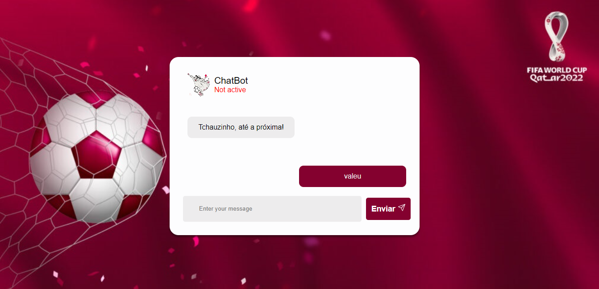
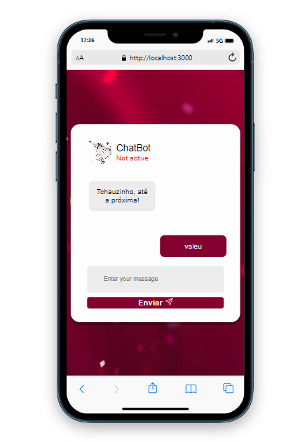
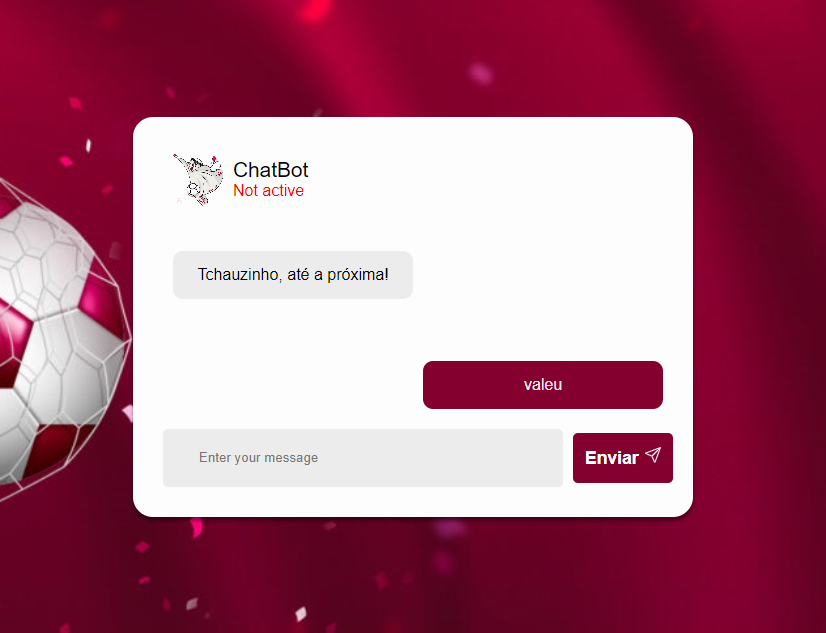

 

  <h1>Bem Vindos(as)!!</h1>
  <strong>ChatBot</strong>

 

## ✌️ ChatBot
<strong>ChatBot sem biblioteca feito em ReactJS, com algumas funções:
  
Posso programar o bot para estar inativo em alguns dias, através de getHours, getSeconds... com useState defino a data atual e com uma função usando if e === defino o estado ativo ou inativo. 
Para as perguntas e respostas defino uma váriavel que recebe um array de várias palavras, uso RegExp para criar um objeto e o test para encontrar a correspondência. Ou seja, quando o usuário inserir uma pergunta ou palavra no input, o sistema vai buscar no array a string e assim enviar a resposta correspondente.</strong>

    
    
    

    

### 🎨 Frontend

*  **ReactJS**: com Visual Studio Code 

## 🙌 Quer Contribuir?

Estamos abertos a todos os tipos de contribuições. Se você quiser:
* 🤔 Sugira um recurso
* 🐛 Informar um problema
* 📖 Melhore a documentação
* 👨‍💻 Contribua com o código

Você é mais que bem vindo. 

Obs: Todos os textos e imagens atuais são ficticios, projeto não concluso.

    <h6>Feito com ❤️ by DebsLorena</h6>
    <a href="https://www.linkedin.com/in/loredebs/"><strong>Linkedin</strong></a> 
    <a href="https://www.instagram.com/debslorena/"><strong>Instagram</strong></a>

